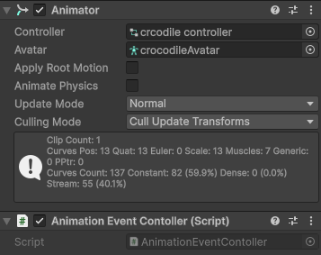

# animation events
It's a system that makes easier to synchronize events with animations.

It uses id's to link an animation frame with an event. It doesn't care about classes or methods,
it can fire or trigger anything. There is no need to inherit from any class or implement any method.

## How to use: 

1. AnimationEventController
    - Place it aside to the animator.

        