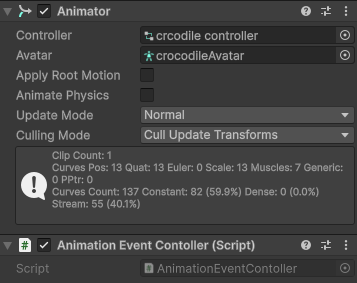
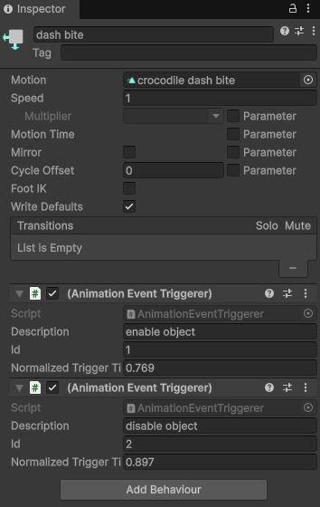
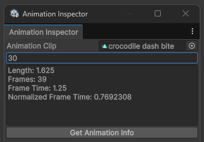
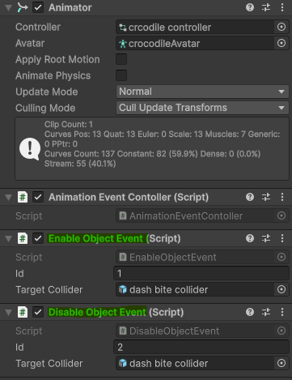

# Unity animation events
It's a system that makes it easier to synchronize events and animations with the help of a simple editor tool.

It uses ID's to link an animation frame with an event. It doesn't care about classes or methods;
it can trigger anything. There is no need to inherit from any class or implement any method.

Here we can see how its used to enable and disable a collider at a concrete moment of the animation:
    

## How to use:
1. AnimationEventController
    - Place it mext to the animator.

        
2. AnimationEventTriggerer
    - Place as many as you want in the desired animator state.

        
    - Type a description so you remember what is that event triggerer for.
    - Set an unique ID to later link it with what ever you want to trigger.
    - To set the normalized trigger time use the animation inspector tool.
    - To open the animation inspector tool go to Window/Animation Inspector.
        
        
    - Asign the animation clip you want to get information about.
    - Type the frame you want to translate to normalized time.
    - Copy the normalized frame time to the normalized trigger time field.
3. What ever you want to trigger
    - Place what ever you want to trigger next to the AnimationEventTriggerer.
    - I have created two scripts, one that enables a GameObject and another that disables it.
        
        
    - Make sure that your script subscribes to the action that's in the AnimationEventTriggerer.
        ```csharp
        public class EnableObjectEvent : MonoBehaviour
        {
            [SerializeField] private int id;
            [SerializeField] private GameObject targetCollider;

            private AnimationEventContoller animationEventContoller;

            private void EnableCollider(int id)
            {
                if (this.id != id)
                    return;

                targetCollider.SetActive(true);
            }

            private void Awake()
            {
                animationEventContoller = GetComponent<AnimationEventContoller>();
            }

            private void OnEnable()
            {
                animationEventContoller.OnEventTriggerd += EnableCollider;
            }

            private void OnDisable()
            {
                animationEventContoller.OnEventTriggerd -= EnableCollider;
            }
        }
    - Make sure the ID of your script and matches with the ID of the AnimationEventTriggerer.

## Summary

AnimationEventTriggerer tells to the AnimationEventController to fire an event with the desired Id.
And any class that is willing to listen to the event can check if the ID is the same as theirs.